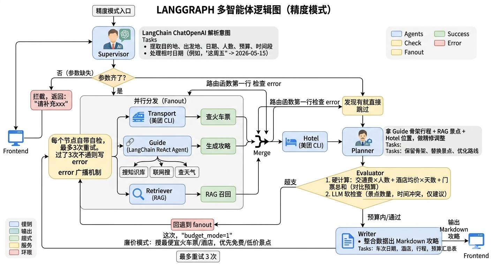

# 旅行攻略规划系统 (Travel Agent Bot)

基于 LangGraph + RAG 的多智能体旅行规划系统，内嵌自建 RAG 知识库（986 个景点），自动完成车票查询、景点检索、酒店匹配、行程编排与预算审核。



## 架构

**Fast 模式**：纯 RAG 链路。Query → Embedding → Chroma 向量检索 → MQE/HyDE 扩展 → LLM 重排序 → 生成。单次约 16 秒。

**Precision 模式**：LangGraph 8 节点 StateGraph。

```
Supervisor → fanout → {Transport‖Guide‖Retriever} → Hotel → Planner → Evaluator → Writer
```

## 数据流向

| 节点 | 读取 | 写入 |
|------|------|------|
| Supervisor | query | intent, previous_intent |
| Transport | intent | transport |
| Guide | intent | guide |
| Retriever | intent, guide | attractions |
| Hotel | intent, guide | hotels |
| Planner | attractions, intent, guide, hotels, evaluation | plan |
| Evaluator | plan, intent, transport, hotels | evaluation, budget_mode, retry_count |
| Writer | error, plan, attractions, intent, transport, hotels, guide | final_output |

## 项目结构

```
travel-agent-bot/
├── app/
│   ├── agents/          # 8 个智能体（Supervisor/Transport/Guide/Retriever/Hotel/Planner/Evaluator/Writer）
│   ├── graph/           # LangGraph 编排层（StateGraph + 条件路由）
│   ├── rag/             # RAG 管道（Chroma + MQE + HyDE + 重排序）
│   ├── llm/             # LLM 客户端（多模型注册表）
│   ├── tools/           # 工具层（天气/美团 CLI）
│   ├── api/             # FastAPI 接口
│   ├── memory/          # 对话记忆
│   ├── models/          # Pydantic 数据模型
│   ├── data/            # 数据加载
│   ├── config.py        # 集中配置
│   └── server.py        # FastAPI 入口
├── frontend/            # Vue 3 前端
├── tests/               # 单元测试（22个）
└── data/                # 运行时数据（景点/向量库/对话记录）
```

## 使用方式

### 启动后端

```bash
cd travel-agent-bot
source venv/bin/activate
uvicorn app.server:app --host 0.0.0.0 --port 8000
```

### 启动前端

```bash
cd frontend
npm install
npm run dev
```

访问 `http://localhost:5173`

## 配置

参数在 `app/config.py` 中集中管理：

| 配置 | 说明 |
|------|------|
| `LLM_MODEL` | 默认模型 |
| `MODEL_REGISTRY` | 多模型注册表（qwen/kimi/glm/deepseek/minimax） |
| `TOP_K` | 检索候选池大小 |
| `ENABLE_MQE` | 多查询扩展 |
| `ENABLE_HYDE` | 假设文档嵌入 |
| `MEMORY_MAX_SIZE` | 记忆缓冲大小 |

## 技术栈

- **编排**: LangGraph StateGraph
- **RAG**: Chroma + MQE + HyDE + LLM Reranking
- **数据源**: 美团 CLI（火车票/酒店）、DuckDuckGo（实时搜索）、wttr.in（天气）
- **大模型**: 接入百炼 API（qwen、kimi、glm、deepseek、minimax）
- **后端**: FastAPI + Pydantic
- **前端**: Vue 3 + Pinia + Vite
- **测试**: pytest（22 个用例）
